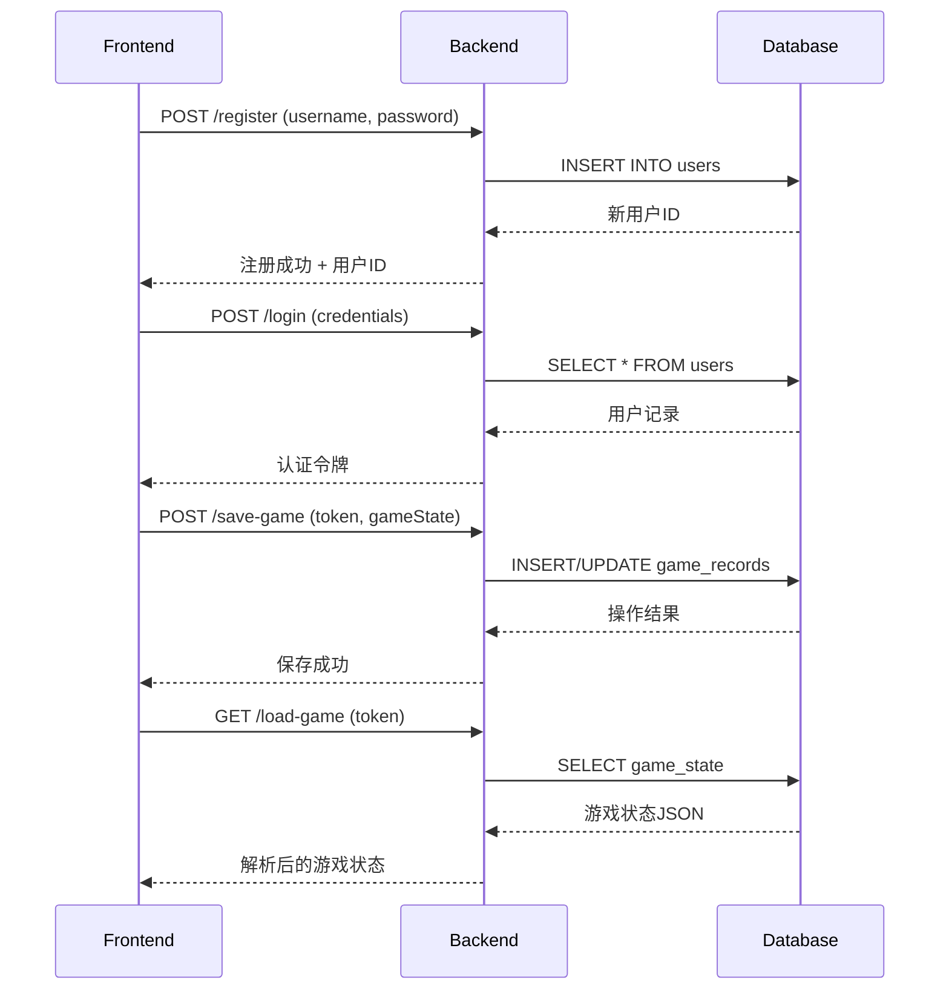

```mermaid
sequenceDiagram
    participant Frontend
    participant Backend
    participant Database
    
    Frontend->>Backend: POST /register (username, password)
    Backend->>Database: INSERT INTO users
    Database-->>Backend: 新用户ID
    Backend-->>Frontend: 注册成功 + 用户ID
    
    Frontend->>Backend: POST /login (credentials)
    Backend->>Database: SELECT * FROM users
    Database-->>Backend: 用户记录
    Backend-->>Frontend: 认证令牌
    
    Frontend->>Backend: POST /save-game (token, gameState)
    Backend->>Database: INSERT/UPDATE game_records
    Database-->>Backend: 操作结果
    Backend-->>Frontend: 保存成功
    
    Frontend->>Backend: GET /load-game (token)
    Backend->>Database: SELECT game_state
    Database-->>Backend: 游戏状态JSON
    Backend-->>Frontend: 解析后的游戏状态
```